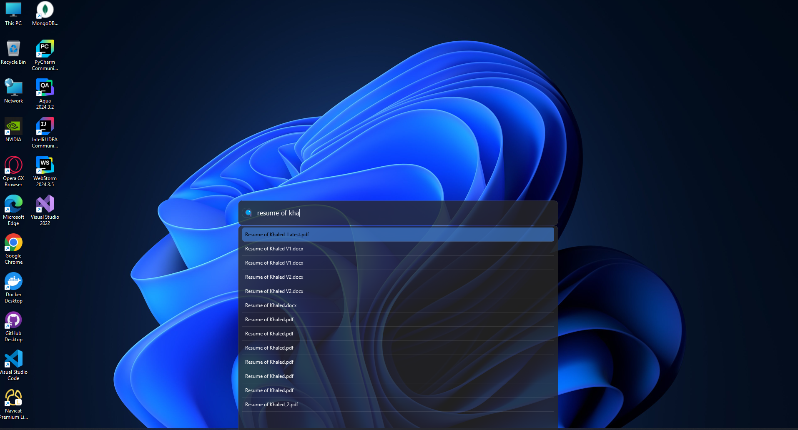

# Khoj Da Search 2.0

A modern, efficient cross-platform desktop search application inspired by macOS Spotlight. Completely rewritten with PyQt6, advanced indexing, and beautiful UI.

## Screenshot


## ✨ New Features (v2.0)

### 🚀 Performance & Efficiency
- **Modern PyQt5/6**: Latest Qt framework for better performance and appearance
- **Full-Text Search**: Lightning-fast search using SQLite FTS5
- **Background Indexing**: Non-blocking indexing that doesn't freeze the UI
- **Incremental Indexing**: Only re-index changed files, not everything
- **Smart File Monitoring**: Real-time updates when files change
- **Optimized Database**: WAL mode, proper indexing, and connection pooling
- **Batch Processing**: Efficient bulk operations for large file systems

### 🎨 Modern UI/UX
- **Beautiful Interface**: Smooth animations and modern styling  
- **Dark/Light Themes**: Automatic theme detection and customization
- **Smooth Animations**: Polished resize and fade transitions
- **Better Typography**: Improved fonts and spacing
- **Enhanced Results**: File type icons, better formatting, relevance ranking
- **Context Menus**: Right-click for Open, Reveal, Copy Path options

### ⚙️ Advanced Features
- **Configuration System**: JSON-based settings with sensible defaults
- **System Tray Integration**: Menu bar status icon showing indexing progress
- **Background Processing**: Indexing runs in background without blocking UI
- **Progress Monitoring**: Optional progress dialog that can be shown/hidden
- **Logging**: Proper logging for debugging and monitoring
- **Error Handling**: Robust error handling and recovery
- **Type Safety**: Modern Python with type hints throughout
- **Modular Design**: Clean separation of concerns and extensibility
- **Smart Exclusions**: Configurable path exclusions (node_modules, .git, etc.)

## Installation

### Requirements
- **Python 3.8 or higher** (recommended: Python 3.10+)
- Modern operating system (Windows 10+, macOS 10.15+, Ubuntu 20.04+)

### Install Dependencies
```bash
pip install -r requirements.txt
```

### Quick Start
```bash
# Test the components first
python test_app.py

# Run the main application
python khoj_search.py
```

## Usage

### Background Indexing
The application now features **smart background indexing**:
- **Non-blocking**: UI remains responsive during indexing
- **System Tray Status**: Check progress via menu bar icon tooltip
- **Optional Progress Dialog**: Right-click tray → "Show Progress" to see detailed progress
- **Immediate Search**: Start searching even while indexing is running
- **Auto-detection**: Only indexes if database is empty or outdated

### Basic Usage
1. **First Launch**: Indexing starts automatically in background
2. **Open Search**: Press Alt+Space to open the search bar
3. **Search Files**: Start typing to see matching results
4. **Navigate Results**: Use up/down arrow keys to navigate through results
5. **Open Files**: Press Enter to open the selected file, or double-click it
6. **Additional Options**: Right-click a result for more options:
   - Open file
   - Open containing folder
   - Copy file path
7. **Dismiss Search**: Click anywhere outside the search window, press Escape, or switch to another application

## Data Storage

The application stores its index database in a platform-specific location:
- **Windows**: `%APPDATA%\KhojDaSearch\search_index.db`
- **macOS**: `~/Library/Application Support/KhojDaSearch/search_index.db`
- **Linux**: `~/.local/share/KhojDaSearch/search_index.db`

This ensures the index persists between application restarts and is stored according to platform conventions.

## Auto-start on Boot (Optional)

### Windows
1. Create a shortcut to the script
2. Press Win+R and type `shell:startup`
3. Move the shortcut to the Startup folder

### macOS
1. Open System Preferences
2. Go to Users & Groups
3. Select your user account and click on "Login Items"
4. Click the "+" button and add the script

### Linux
Create a .desktop file in `~/.config/autostart/`:
```
[Desktop Entry]
Type=Application
Name=Khoj Da Search
Exec=python /path/to/khoj_da_search.py
Hidden=false
NoDisplay=false
X-GNOME-Autostart-enabled=true
```

## Troubleshooting

### Search Not Appearing
- Ensure no other application is using the Alt+Space hotkey
- Try restarting the application

### Slow Indexing
- The initial indexing might take time depending on the number of files
- Subsequent launches will be faster as the index is reused

### Missing Files in Search
- By default, hidden files and system directories are excluded
- The application indexes most common file locations

## Building a Standalone Executable (Optional)

You can create a standalone executable using PyInstaller:

```bash
pip install pyinstaller
pyinstaller --onefile --windowed --name "Khoj Da Search" khoj_da_search.py
```

The executable will be created in the `dist` directory.